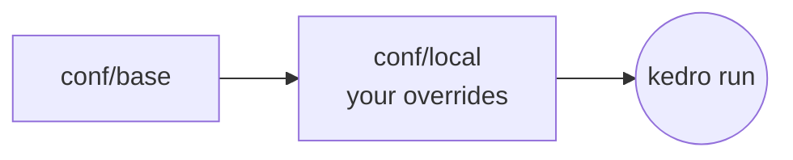

# `conf/local/`

Machine-specific overrides and credentials. Git-ignored except this README and `.gitkeep`;
Kedro's default run environment.

```mermaid
flowchart LR
    base[conf/base] --> local[conf/local<br/>your overrides] --> run((kedro run))
```
